# VMCLI

A set of utilities to help you manage VMs with `Virtualization.framework`



## Installation

```
# make sure xcode command-line tools are installed
xcode-select --install

# run build, install. This will install vmcli and vmctl to /usr/local/bin
make
sudo make install
```

You have now finished installing `vmcli` and `vmctl`

Set envirionment variable `VMCTLDIR` to `~/VMs` so `vmctl` knows how to find VMs.
If you don't set this, `vmctl` will use current working directory to find VMs.
```bash
echo 'export VMCTLDIR="$HOME/VMs"' >> ~/.zprofile
export VMCTLDIR="$HOME/VMs"
```

Provision a Ubuntu VM, and install that to `~/VMs`.
The VM will auto create your user with your ssh public key at `~/.ssh/id_rsa.pub`.
```bash
make build/vm/ubuntu
mv build/vm/ubuntu ~/VMs/ubuntu
```

Optionally expand the VM volume, for example to 16G.
```bash
dd if=/dev/null of=~/VMs/ubuntu/disk.img bs=1g count=0 seek=16
```

Optionally edit the VM config for more RAM and/or CPU cores
```bash
vi ~/VMs/ubuntu/vm.conf
```

Start the VM
```bash
vmctl start ubuntu
```

Attach to the serial console, use (CTRL+A - D to quit)
```
vmctl attach ubuntu
```

You can use `vmctl ip ubuntu` to check your VM IP.

Wait for the VM to boot and ssh into the VM
```
vmctl ssh ubuntu
```

You should shutdown the VM using ssh within the VM.
If that's not an option, you can forcibly shut it down.
```
vmctl stop ubuntu
```

## Usage

### vmcli

```
USAGE: vmcli [--cpu-count <cpu-count>] [--memory-size <memory-size>] [--memory-size-suffix <memory-size-suffix>] [--disk <disk> ...] [--cdrom <cdrom> ...] [--network <network> ...] [--balloon <balloon>] [--bootloader <bootloader>] [--kernel <kernel>] [--initrd <initrd>] [--cmdline <cmdline>] [--escape-sequence <escape-sequence>]

OPTIONS:
  -c, --cpu-count <cpu-count>
                          CPU count (default: 1)
  -m, --memory-size <memory-size>
                          Memory Bytes (default: 512)
  --memory-size-suffix <memory-size-suffix>
                          Memory Size Suffix (default: MiB)
  -d, --disk <disk>       Disks to use 
  --cdrom <cdrom>         CD-ROMs to use 
  -n, --network <network> Networks to use. e.g. aa:bb:cc:dd:ee:ff@nat for a nat device, or ...@en0 for bridging to en0. Omit mac address for a
                          generated address. (default: nat)
  --balloon <balloon>     Enable / Disable Memory Ballooning (default: true)
  -b, --bootloader <bootloader>
                          Bootloader to use (default: linux)
  -k, --kernel <kernel>   Kernel to use 
  --initrd <initrd>       Initrd to use 
  --cmdline <cmdline>     Kernel cmdline to use 
  --escape-sequence <escape-sequence>
                          Escape Sequence, when using a tty (default: q)
  -h, --help              Show help information.
```

### vmctl

```
usage: vmctl {start|stop|attach|ip|ssh} vm
```

## References

[SimpleVM](https://github.com/KhaosT/SimpleVM) is a proof-of-concept using `Virtualization.framework` by [KhaosT](https://github.com/KhaosT)

[vftool][https://github.com/evansm7/vftool] is a very similar tool written by [evansm7](https://github.com/evansm7) but in Objective-C not Swift.
